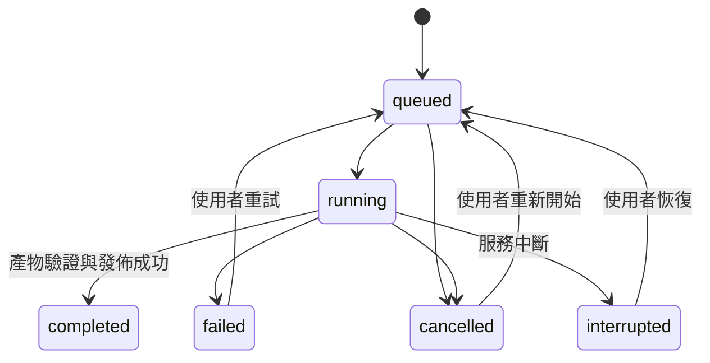

# YouTube 影片工作區：第一版功能與介面規格

日期：2026-10-04。狀態：**Q18 已於 2026-10-04 確認（A），作為實作依據；實作進行中。**

[訪談紀錄](youtube-workspace-interview.md)的 Q1–Q17 已確認。
以下 D1–D8 已隨 Q18 確認；模型候選仍須以真實 key 驗證權限。
2026-10-04 修訂：依唯讀 review 補上共同發佈條件、匯出快照、引用下限、翻譯來源入口、
播放切換零工作與對話記憶提案，並加入 [Gemini API 查證](gemini-api-notes.md)。
本文件定義功能與互動；視覺風格、精細排版及框架安裝不在本輪執行。

## 1. 使用成果

在自己的電腦啟動服務，以瀏覽器貼入一支 YouTube 網址，選擇實際可用畫質、
一個目標字幕語系，以及是否附加原文。完成後可保存附可切換字幕軌的影片，
在本機工作區觀看、換字幕、匯入修正版，並向 Gemini 詢問影片內容及相關知識。
影片、字幕版本與對話跨服務重啟保留。

### 已確認的三個獨立選擇

| 選擇 | 影響 | 既有資料處理 |
| --- | --- | --- |
| 播放字幕 | 播放器顯示的字幕版本／語言 | 不改變問答來源或既有成品 |
| 問答依據 | 新對話採用哪份字幕／逐字稿 | 更換時另開對話，保留舊來源與引用 |
| 匯出字幕 | 下一個下載成品包含的目標版本及原文軌 | 不刪除原文，不覆寫已匯出成品 |

## 2. 待整體確認的預設（D1–D8）

| 編號 | 建議 |
| --- | --- |
| D1 來源與環境 | 首版支援無須登入即可取得的單支隨選影片（含 Shorts／不公開連結），不處理直播、登入 Cookie 或播放清單。以 Apple Silicon macOS、Chrome／Safari 桌面版驗收。 |
| D2 操作預設 | 介面及問答預設繁中；目標字幕預設繁中；「附加原文字幕」預設關閉。畫質預選來源中不高於 1080p 的最高畫質，使用者可改選其他實際可用畫質。 |
| D3 字幕使用 | 播放時一次顯示一軌，可關閉；原文與目標分成獨立軌，不做雙語同屏。提供單份字幕 SRT／VTT 匯出；匯入、重新翻譯均建立版本，須明確選用。 |
| D4 工作與預覽 | 工作有階段進度、取消、手動重試。關閉分頁後服務仍在就繼續；服務重啟後不自動重送未完成雲端工作。必要預覽採最高 720p H.264／AAC MP4，不放大來源。 |
| D5 儲存清理 | 資料置於專案的 `outputs/library/`，可用設定改位置；只手動刪除影片及其資料。獨立清除可重建預覽，不自動清除字幕或對話；整支刪除顯示範圍並二次確認。 |
| D6 Gemini 設定 | 後端讀取 `.env`；明確啟動選項（非金鑰）＞程序環境變數＞`.env`＞預設。翻譯與問答模型可分別設定，候選預設為翻譯 `gemini-3.5-flash-lite`、問答 `gemini-3.8-flash`（未實測帳戶權限與品質）；關閉 SDK 自動重試，由使用者手動重試。缺 key 只停用 Gemini 操作，不阻擋已有字幕的下載／播放。 |
| D7 問答邊界 | 引用可點擊跳至對應時間；回覆分為「影片內容」「補充知識」「缺乏依據」。首版完整傳入選定來源，對話記憶為最近 8 組成功完整問答＋目前問題（第 6 節）；先計算 token，超限明確阻擋，不靜默截斷，也不加入檢索／向量資料庫。 |
| D8 實作結構 | 沿用 Python，建議 FastAPI／Uvicorn 提供本機 API 及 HTML／CSS／JavaScript；yt-dlp 下載、既有 ffmpeg／MLX 處理、官方 Gemini SDK、SQLite 加檔案保存。新增 `vcc serve` 入口；既有 CLI 指令保留原契約。 |

## 3. 介面配置與操作

工作模式是反覆觀看、核對字幕與提問。主要操作是「載入影片」及影片開啟後的「送出問題」。
影片標題、實際畫質、字幕來源與目前問答依據保持可見。

```text
┌ 影片工作區 ─────────────── 任務狀態 ／ Gemini 設定狀態 ┐
│ YouTube 網址 [                         ] [載入影片]   │
├ 影片庫 ───────┬ 播放與字幕 ──────────┬ 影片問答 ──────┤
│ 搜尋標題     │ 影片標題、來源資訊    │ 問答依據／版本 │
│ 影片＋狀態   │                      │ 對話紀錄       │
│ 最近觀看     │      播放器          │                │
│              │                      │ 影片內容       │
│              │ 播放字幕 [版本 ▾]    │ [時間戳引用]   │
│              │ 字幕列表／匯入字幕   │ 補充知識       │
│              │                      │                │
│              │ 畫質 [▾] 語系 [▾]   │ 問題輸入       │
│              │ □ 附加原文字幕       │ [送出]         │
│              │ 格式摘要 [匯出影片]  │                │
└──────────────┴──────────────────────┴────────────────┘
```

這是功能配置草圖，並非已選定的視覺風格。窄視窗改成上方播放器、下方「字幕／問答」
分頁，影片庫收合；切換分頁保留輸入草稿及播放位置。避免三欄各自縮小到不可讀。

### 首次匯入

1. 貼上網址並按「載入影片」，只讀取標題、時長、實際畫質與字幕清單。
2. 呈現畫質、字幕目標語系、原文開關與來源語言。列出預計步驟，例如
   「下載 → 取得英文字幕 → 翻譯為繁中 → 匯出」；按「開始處理」才建立處理工作。
3. 影音就緒即可播放；原文就緒即可問答，目標語系翻譯與成品封裝可繼續顯示進度。
4. 下載完成、字幕完成、預覽完成及匯出完成各自有狀態，只有所要求的成品驗證完成
   才顯示「可下載」。重新開啟已完成項目不自動觸發外部呼叫。

### 重新使用與字幕更換

- 開啟影片庫項目，還原播放位置、播放字幕與最後使用的對話。原始網址只作來源紀錄。
- 切換播放字幕立即生效，保留播放位置；「關閉」只關閉顯示。
- 匯入檔案時指定語言與版本名稱；解析成功先加入列表，提供「用於播放」、
  「設為問答依據」與「以此版本翻譯」。新檔案不自行取代既有選擇。
- 問答依據列顯示語言、來源類型、版本。切換後提示「已建立新對話」，可回到舊對話。
- 翻譯區顯示「翻譯來源」摘要（語言、來源類型、版本）。翻譯來源只能由使用者明確
  指定或由第 5 節的自動來源流程決定，不隱式跟隨播放字幕或問答依據。
- 切換播放字幕只改變播放選擇，不建立翻譯、封裝或其他工作；只有按「翻譯」或
  「匯出影片」才建立對應工作。
- 匯出區清楚顯示所選目標字幕版本、原文開關與格式；按下匯出時固定選擇快照
  （第 4 節），之後修改只影響下一個成品，重用已下載影音。

### 必要狀態及可及性

| 狀態 | 畫面與可用操作 |
| --- | --- |
| 空影片庫 | 顯示網址輸入與簡短使用說明，不放假影片或假對話 |
| 載入來源中 | 顯示正在查詢與取消；重複點擊不建立重複工作 |
| 等待／執行中 | 顯示階段、已知的位元組／片段進度；未知總量用不定進度，不假造百分比 |
| 來源／處理失敗 | 說明失敗階段、已保留成果及對應重試操作 |
| Gemini 未設定 | 顯示 `.env` 欄位名與重新載入方式；不顯示 key，不提供瀏覽器 key 輸入框 |
| 無問答依據 | 問答送出停用，提供取得字幕或匯入字幕的入口 |
| 預覽失敗 | 保留字幕、問答與成品下載；時間引用仍顯示原文與時間，說明目前不能跳播 |

所有輸入有可見標籤；鍵盤可操作選單、匯入、對話與引用；不攔截輸入框的空白鍵
作播放快捷鍵。進度更新以狀態區宣告，錯誤不只靠顏色；不讓聊天更新搶走輸入焦點。
繁中、拉丁字與長影片標題可換行；小視窗、放大 200% 仍可操作。

## 4. 來源、畫質與成品規則

- 接受明確 YouTube 影片 URL；解析 host 與影片 ID，拒絕其他站點、任意檔案路徑、
  多網址與純播放清單。含 `list` 的單片連結只處理該影片；不展開播放清單。
- 來源已下架、需登入、直播或無可取得影音時，回報來源不支援／無法取得，不改走其他站點。
- 畫質只選解析度（2026-10-04 更新，ADR 0004）：查詢回傳去重後的實際來源高度清單，
  不放大、不列不存在的解析度。預設為不高於 1080p 的最高解析度；全部高於 1080p 時
  預選其中最低並明示。首次匯入與影片庫重新匯出（已保存影音依解析度列出）都只列
  解析度，FPS、編碼與 format ID 不再出現在選單。
- 系統依「解析度＋字幕形式」自動解出實際來源版本（同高度內，下載器清單越後面品質越佳）：
  - **燒錄字幕**：該高度 FPS 最高者，同 FPS 依下載器品質排序取最佳，不限編碼；
    成品一律重新編碼為 MP4。
  - **可切換字幕軌**：優先 H.264 視訊＋同一音軌的 AAC 版本（同高度多支 H.264 時取
    FPS 最高、品質最佳），成品為 MP4；無 H.264 或無 AAC 時依 FPS／品質取最佳，
    搭配預設音軌，容器依既有規則（非 H.264＋AAC 即 MKV）。介面顯示 MP4／MKV 結果。
  - 在一鍵流程（字幕形式選擇）上線前，下載工作預設以可切換字幕軌解出，與現有匯出
    成品一致。
- 音軌自動選原語言的預設軌，介面唯讀顯示語言與編碼，不提供選擇；不以配音軌冒充原音。
  無法判定原語言時顯示「未知」。可切換字幕軌模式可改用同一音軌的 AAC 版本。
- 開始後固定解出的 format ID 與音軌。來源格式消失時要求重新查詢、重新選擇解析度，
  不靜默改畫質／音軌。
- 匯出以所選來源影音 stream copy；先判斷 MP4 能否封裝影音及目標字幕，否則用 MKV。
  顯示實際格式及字幕軌摘要後才匯出；執行中若需更換顯示過的格式，回到確認狀態。
- 建立匯出工作時保存完整選擇快照：影音資產 ID、翻譯來源版本、目標字幕版本與語系、
  原文開關及原文版本、確認過的容器。工作只讀快照，排隊或執行期間介面改選只影響
  新工作；成品紀錄保存同一快照，供日後辨識成品內容。
- 兩種容器都失敗時保存來源與字幕並回報錯誤，不轉碼成品、不以相容預覽冒充成品。
- 字幕可轉容器所需格式；不承諾完整保留 SRT／VTT 的樣式。外部播放器驗收以 VLC
  的 MP4／MKV 切軌為基準；其他播放器沒有測過就不宣稱支援。
- 檔名使用清理後標題、影片 ID、畫質、匯出 ID，保留 Unicode、移除路徑成分。
  匯出不能覆寫來源、使用者外部檔案或舊成品。

依據：[媒體相容性查證](media-compatibility-notes.md)。預覽播放使用獨立 WebVTT 軌，
不依賴瀏覽器辨識下載成品內嵌字幕。[MDN track](https://developer.mozilla.org/en-US/docs/Web/HTML/Reference/Elements/track)

## 5. 字幕、翻譯與版本

### 取得原文與目標語系

- **未指定可用匯入來源時**，原文依序選 YouTube 原語言人工字幕、自動字幕；
  **確認都沒有**才在本機辨識。字幕清單讀取失敗提供重試，不將網路錯誤當成沒有字幕。
- 使用者對匯入版本按「以此版本翻譯」後，該版本即為翻譯來源；之後的翻譯不回退
  平台原文，也不重跑語音辨識。自動流程不能取代使用者指定的翻譯來源。
- 來源語言以可得 metadata 為線索並顯示供修正。本機辨識採多語處理，不套用既有 CLI
  中文專用提示／正規化到所有語言；語言不明時先保留「未知」，不臆測目標語系即原文。
- 有來源平台提供的目標語系字幕時可選用，保留人工／自動來源標籤；不把平台即時機翻
  當作原語言自動辨識。需翻譯時由 Gemini 從明確選定的來源版本產生。
- 目標語系選單首批為繁中 `zh-TW`、簡中 `zh-CN`、英文、日文、韓文、西文、法文、德文，
  並列出來源已有的其他語系；未列出的新翻譯語系留待後續擴充。
- 既有同來源版本／目標語系／模型／翻譯規則的完整結果可重用；按「重新翻譯」建立新版本。
  翻譯修正版匯入字幕時，明示其 parent version，不能自動回退到舊原文。

### 匯出矩陣

| 目標與原文 | 附加原文 | 匯出 |
| --- | --- | --- |
| 語系不同 | 關 | 只有所選目標版本 |
| 語系不同 | 開 | 所選目標版本＋原文版本 |
| 同一語系、同一份版本 | 任意 | 一軌，不重複放入 |
| 同一語系、不同修正版 | 關／開 | 關：所選版本；開：所選版本＋原文，名稱標示版本差別 |

語系比較須區分 `zh-TW` 與 `zh-CN`，不能只比 `zh`。保留原文版本的儲存與問答引用
不受開關影響。上表為字幕形式「可切換字幕軌」（`tracks`）的行為，原文另成一軌；
燒錄字幕的「附加原文」一律是雙語在同一軌（見下節）。

### 燒錄字幕成品

匯出可選字幕形式 `burned`（燒錄字幕）或 `tracks`（可切換字幕軌，沿用上表與 stream
copy）。燒錄依 [ADR 0004](../adr/0004-burned-in-subtitle-export.md) 重新編碼，為
[ADR 0003](../adr/0003-separate-preview-and-export.md) 不轉碼的例外：

- 燒錄單一目標字幕版本，或勾選「附加原文」時燒錄雙語：目標語系在上、原文在下，各自
  用不同的 ASS 樣式與 cue 時間；成品一律 MP4，視訊為
  VideoToolbox 硬體編碼 H.264（依解析度給定目標位元率），解析度與來源一致、不縮放；
  來源音訊為 AAC 時 copy，否則轉 AAC。
- 固定樣式：白字黑邊、置底置中，字級約為影片高度 5%（直式影片以寬度為準），字型依
  語系選 macOS 系統字型（繁中 Heiti TC、簡中 Heiti SC、日文 Hiragino Sans、韓文
  Apple SD Gothic Neo、其他 Hiragino Sans GB），缺字由 libass 逐字回退。長行依估計
  字寬自動換行：中日韓文字可在字間斷行，拼音文字在空白斷行，句末標點不置於行首。
- 字幕時間取自所選字幕版本的 cue 起訖（ASS 精度為 1/100 秒）；字幕文字中的
  樣式標記不被執行。
- 雙語燒錄（`include_original`）以兩個樣式同時上畫面：目標樣式字級較大、底邊界提高，
  原文樣式字級較小（約影片短邊 3.5%）、沿用原本的底邊界，因此目標恆在原文上方。兩份
  字幕各依自己的 cue 起訖顯示，不合併、不重新對時；同一份版本同時是目標與原文時只
  渲染一行。切換字幕軌的「附加原文」仍維持原文另成一軌，不新增雙語單軌。
- 確認摘要時先以極短片段試編，硬體編碼不可用即明確失敗
  （`hardware_encoder_unavailable`），不回退軟體編碼、不降畫質。
- 輸出前依目標位元率與片長預檢磁碟空間；進度以 ffmpeg 已處理時長／總時長回報，
  總時長未知時為不定進度；取消即終止 ffmpeg 子程序。
- 沿用原子發佈，成品以新 ID 命名，不覆寫來源或舊成品；成品紀錄保存字幕形式與雙語
  開關（快照 `subtitle_form`、`include_original` 與 `export_artifacts.subtitle_form`），
  既有成品遷移後為 `tracks`。

### 匯入驗證與不可變版本

- 接受 UTF-8（可含 BOM）SRT／WebVTT；首版上限 10 MiB、100,000 cues，超限清楚回報。
- 時間必須有限、非負且 start < end；依開始時間排序，允許合理重疊，不自動拉伸時間。
  超出片長最多容許 1 秒的尾端誤差並明示裁切；超過則拒絕並提示檢查影片版本。
- 不把字幕 HTML、腳本或外部連結當可執行內容。顯示／匯出保留文字，移除不支援樣式。
  解析失敗回報 cue／行號；整份通過才發佈，不使用半份字幕。
- 每版有不可變 ID、來源、語系、parent ID、內容 hash、片段 ID 與起訖時間。
  同檔名再次匯入不能覆蓋舊版；字幕名字不是版本識別碼。

### Gemini 翻譯

- 以來源片段 ID 分塊翻譯，只請模型產生對應文字；起訖時間由原片段複製。
  可提供相鄰片段作脈絡，但只接受本塊指定 ID 的結果。
- 驗證 ID 集合完整、無重複／新增／缺失、文字非空且符合輸出 schema；任何一塊失敗
  保留已完成塊供手動重試，整版保持未完成，不能冒充完整目標字幕或供問答選用。
- 相同來源及設定才可續接；變更來源、語系或模型建立新工作。重新開啟影片不觸發翻譯。
- 「原文保留」指資料版本保留；送給 Gemini 的內容是所需文字與提問，不上傳影片／音訊。

## 6. 影片問答與可信引用

- 每串對話固定 `(video_id, source_version_id)`。預設首次對話使用取得的原文，
  回覆語言為繁中，可在該次提問要求其他語言；翻譯語系不改變問答回覆語言。
- 模型輸出區分影片主張、引用的片段 ID、補充知識與「缺乏依據」。後端只接受目前來源
  的 ID，從保存版本計算時間戳與引用原文；不採信模型自寫的秒數或其他影片 ID。
- 每項影片主張必須至少引用一個目前來源的有效片段 ID；找不到依據時，模型應改用
  「缺乏依據」類別。後端發現任何空引用或引用全部無效的主張，整份回覆視為驗證失敗、
  可重試，不顯示也不持久化；後端不自行把主張改寫成其他類別。
- 點擊引用跳到該片段起點，並展開**當時依據版本**的原文；不要求更換目前播放字幕。
- 模型只能以字幕／逐字稿支持影片主張；字幕沒說的畫面、人物動作或圖表應回答
  「目前文字依據未提供」。來源未支持的論斷不能包裝成影片內容。
- 補充知識清楚標示未經網路查證；不捏造外部來源、影片引用或聲稱掌握最新資訊。
  ID／schema 驗證只能驗證結構與定位，不能保證語義忠實，仍需回答品質驗收。
- 將來源文字視為資料，內含要求改寫規則／洩漏金鑰等內容不可成為系統指令；
  問答模型不提供 shell、檔案修改、搜尋或其他 agent 工具權限。
- 首版完整提供所選字幕來源，配合有界對話脈絡（**提案，待 Q18 確認**）：
  - 來源始終完整傳送；對話記憶為最近 8 組「成功、已驗證、完整」的問答＋目前問題。
  - 失敗、取消、驗證未過的回覆不進入記憶；第 9 組之前的問答仍保存可見，但不再送出。
  - 對話區顯示本輪記憶範圍，例如「本次參考最近 8 組問答」，較早問答標為不在記憶內。
  - 若來源＋記憶＋問題仍超限，先減少送出的舊問答；連最少的「來源＋目前問題」都超限
    才阻擋，並提示改用較短來源另開對話。
- 每次以所選模型的 `count_tokens` 預計算 token，應用輸入上限建議 200,000，且不得
  超過模型上限扣除輸出／安全餘量；計數只是預檢，不宣稱與實際計費完全相同。
  不切掉來源尾部、不用摘要假裝看過整片。
- 同一對話一次一個請求。來源切換後，進行中回覆只能寫回原對話，不能出現在新來源下。
  同樣禁止切換影片時把回覆附到另一影片；每次 request 固定對話、來源與訊息 ID。
- 回覆先整份驗證再顯示／持久化；首版不串流未驗證答案。須檢查 finish reason；
  MAX_TOKENS、安全阻擋、空輸出或壞 JSON 都屬失敗。失敗保留問題與可重試狀態，
  不把部分答案加入下一輪脈絡。遲到結果依第 7 節的發佈條件處理。
- 可刪除一串對話；仍被其他對話／成品引用的字幕版本不可單獨永久刪除。

## 7. 工作、保存與錯誤政策



- 每次進入 running（首次、重試、恢復、重新開始）都建立新的 attempt ID；工作紀錄只
  認目前 attempt。刪除影片、對話或字幕版本時，先在 transaction 中把目標標成不可寫
  （deleting），再停止相關工作與清理檔案。
- **共同發佈條件**：任何產物或回覆發佈時，在同一 DB transaction 中原子核對
  ①attempt ID 仍是該工作目前 attempt、②工作仍為 running、③所屬影片／對話／
  來源版本仍有效且可寫。任一不符就丟棄結果與暫存檔；即使內容驗證成功，
  舊 attempt 的結果也不可寫入。取消、超時、重試、刪除後的遲到結果皆依此處理。
- 以每個階段的工作紀錄管理生命週期，媒體重工作同時一個；Gemini 請求亦限制並行數為一。
  問答可在目前翻譯塊完成後優先執行，避免整片翻譯期間不能提問。
- 取消停止排隊、終止所屬媒體子程序或停止後續 API 塊；已送出的雲端請求可能已計費。
  不承諾退款／遠端撤銷；取消不得發佈未驗證產物。
- 網路／429／5xx 不無限重試。首版雲端錯誤均保存進度並由使用者重試，避免超時時
  重複付費；顯示服務回報的可重試等待時間。401／403／模型不存在直接提示設定問題。
- 服務重啟把執行中工作標成中斷，不自動再送 API。只有 fingerprint、checksum 與
  設定相符的完成階段能跳過；未知完成狀態不能假定成功。
- 同一影片可有多個畫質資產；以影片 ID 去重庫項目。重複匯入先開啟既有項目，
  更換畫質只建立必要下載。切換播放字幕只改變播放選擇；翻譯與封裝只在使用者明確
  要求翻譯或匯出時建立工作，並重用相符的既有結果。
- 資料庫保存關聯與任務狀態，媒體／字幕產物以受控 ID 目錄保存；先寫暫存檔、驗證，
  再以原子發佈與 DB transaction 記錄完成。中斷留下的孤兒檔可辨識、可清理。
- `outputs/library/` 建議保存資料庫、來源影音、字幕版本、對話、預覽與成品；
  `VCC_LIBRARY_DIR` 可指定其他位置。相對路徑都相對於啟動時確定的專案根目錄。
- 預覽保留直到手動清除；再次需要時顯示「重新製作預覽」，不默默重跑。
  整支影片刪除前列出影音、字幕、對話、成品數量，先停止相關工作再刪除管理範圍。
  使用者另存到影片庫外的成品不受影響；部分刪除失敗顯示待清理狀態。
- 不自動因磁碟不足刪除資料；在重工作前估算空間、標示估算不確定性。
  空間不足或寫入失敗保留已完成階段，顯示需要清理空間及手動重試。
- 本機資料庫與檔案為使用者可讀的本機資料，首版不加入同步或應用層加密。

## 8. 設定與實作邊界

### 建議新增設定（目前尚不存在）

| 設定 | 用途 |
| --- | --- |
| `GEMINI_API_KEY` | 翻譯與問答共用，僅後端存取 |
| `VCC_GEMINI_TRANSLATION_MODEL` | 翻譯模型；候選預設 stable `gemini-3.5-flash-lite` |
| `VCC_GEMINI_QA_MODEL` | 問答模型，獨立可調；候選預設 stable `gemini-3.8-flash` |
| `VCC_LIBRARY_DIR` | 預設 `outputs/library/`，相對於專案根目錄 |

- 建議 `uv run vcc serve --project-dir .` 啟動；先解析專案根目錄，固定讀取該處 `.env`，
  不搜尋上層／家目錄的憑證。啟動選項屬提案，不能當作現有可執行命令。
- 自動 `.env` 載入先限新增網頁入口，不全域改變原 CLI 的設定優先序。
  明確啟動值（非金鑰）＞程序環境變數＞`.env`＞內建預設。金鑰不接受 CLI 參數。
- 將解析後的 `GEMINI_API_KEY` 明確傳入 SDK 的 `api_key`。官方 SDK 自動讀環境時
  `GOOGLE_API_KEY` 優先於 `GEMINI_API_KEY`，因此不能依賴 SDK 自動讀取；
  `GOOGLE_API_KEY` 不屬於本產品契約，不作為後備。
  只顯示「已設定／未設定」及模型名稱；修改 `.env` 後重啟服務生效。
- 模型預設使用固定 stable ID，不用 `latest` alias；候選 ID 的帳戶權限、品質與
  quota 尚未實測，實作時以真實 key 驗證後才定案。
- 明確關閉 SDK 自動重試（`HttpRetryOptions.attempts` 設為 1，該值含第一次請求），
  與「雲端失敗由使用者手動重試」一致，避免隱藏重送與重複計費。Quota 依 project／
  model／tier 計算，不按每支 key 計算。
- 查證來源與未驗證處：[Gemini API 查證](gemini-api-notes.md)。
- 缺 key 在送出前擋下翻譯與問答；下載、播放、字幕匯入、已存在結果匯出仍可用。
  若工作要求翻譯，整體顯示等待設定，不能悄悄輸出原文當成目標語系。
- 設定模型失效／帳戶無權限時清楚失敗，不靜默改模型；模型 ID 參與快取識別。
- key 使用 `SecretStr` 與既有 redaction；不寫入 URL、browser storage、DB、產物、
  hash、錯誤或日誌；`.env.example` 只加空欄位說明，真實 `.env` 保持 gitignore。
- 僅綁定 loopback；驗證 Host／Origin、限制 CORS、保護寫入請求免受跨站呼叫。
  檔案 API 使用受控 ID 映射，不接受任意伺服器路徑；子程序使用 argv，不插值 shell。
  本機服務不是供 LAN／公網部署的多人服務。

### 模組與依賴提案

| 邊界 | 責任與沿用範圍 |
| --- | --- |
| 網頁／API | 輸入驗證、DTO、播放器、狀態回報；不能直接讀憑證／任意磁碟檔案 |
| 工作區服務 | 影片、字幕版本、成品、對話與工作生命週期；協調 provider |
| YouTube／媒體 | yt-dlp metadata／下載；既有 ffprobe／ffmpeg；新增字幕封裝與預覽 |
| 字幕／轉錄 | SRT／VTT 解析、cue 契約、MLX 本機轉錄；不繼承中文限定假設 |
| Gemini | 官方 `google-genai` SDK；翻譯／問答各自 schema，顯式 key／model |
| 儲存 | 標準庫 SQLite ＋檔案；版本不可變、關聯完整、原子發佈 |

新增依賴候選為 FastAPI、Uvicorn、yt-dlp、google-genai、python-dotenv，字幕 parser
優先評估能正確處理 SRT／VTT 的小型套件；實作時查證 Python 3.13 支援並鎖進 uv.lock。
不引入 Node build、向量資料庫或另一個雲端後端。既有 pipeline 的同步進度 callback
可以轉接，並不代表它已提供背景佇列／取消；Claude 六段報告不挪作問答模型。

## 9. 驗收與分段實作

| 驗收 | 可觀察結果 |
| --- | --- |
| AC01 網址與畫質 | 單片正常；list 參數不展開；純清單／其他主機拒絕；只列真實畫質且格式消失不降級 |
| AC02 字幕來源 | 人工／自動／無字幕三種 fixture 依序使用；讀取失敗不啟動辨識；多語無中文強制轉換 |
| AC03 原文開關 | 按第 5 節四列矩陣，以 ffprobe 查實際軌數、語言、版本；外部播放器可切軌／關閉；匯出排隊或執行中改選目標／原文開關，成品仍符合建立時快照 |
| AC04 匯入更換 | 有效 SRT、VTT 均成功；壞格式、過長時間、過大檔案失敗；切換不影響播放位置或問答依據；切換播放字幕時 provider 呼叫與封裝工作皆為零 |
| AC05 翻譯 | 時間／ID 保持；缺塊、重複 ID、截斷回應、MAX_TOKENS 不發佈；重試只續相符塊；缺 key 不呼叫 API；「以此版本翻譯」後的翻譯使用該匯入版本，不回退平台原文、不啟動辨識 |
| AC06 輸出與預覽 | MP4／MKV 相容分支、兩者失敗、瀏覽器無法播放分支皆驗證；影音不重新編碼；預覽不覆寫成品 |
| AC07 引用 | 引用只映射當前來源；未知 ID 拒絕；空引用主張、部分主張漏引用都不以影片內容顯示；跳播時間與來源一致；畫面問題不臆測；補充知識與缺乏依據清楚區分；另以人工樣本核對語義忠實 |
| AC08 版本與競態 | 更換依據開新對話；舊版本／引用不變；延遲回覆只回原對話；「取消→重試→舊 attempt 回覆到達」與「刪除→重新匯入→舊回覆到達」皆不寫入；記憶範圍排除失敗／取消回覆且介面顯示範圍 |
| AC09 保存與重試 | 真正停止服務再啟動仍可觀看續問；已完成階段不重跑；執行中工作變中斷；取消、429、磁碟不足可恢復 |
| AC10 設定與安全 | 測試 key 能由 `.env` 載入且優先序正確；未出現在任何輸出；非法路徑、跨站寫入、惡意字幕被阻擋 |
| AC11 長來源 | 總 token 包含來源、問題、對話記憶與 system instruction；超限先減少送出的舊問答，連「來源＋目前問題」都超限才明確拒絕、零生成呼叫；不截斷來源或冒稱閱讀全片 |
| AC12 可用性 | Chrome／Safari 實播、VLC 成品切軌、鍵盤、200% 放大與窄視窗走完核心流程 |

### 垂直切片

1. 本機服務、設定、影片庫：建立頁面與持久化，驗證 loopback／憑證／重啟。
2. 單片查詢下載、實際畫質、播放：驗證失敗／取消與來源 stream copy。
3. 字幕取得匯入、Gemini 翻譯、軌道匯出：完成字幕矩陣與翻譯中斷恢復。
4. 問答、來源版本、引用跳播：完成競態與品質驗收。
5. 相容預覽、清理與整體 UI：兩個瀏覽器＋VLC 核心情境，既有 CLI 回歸。

每一片先有可重現的驗收再擴充。線上影片、Gemini 品質與播放器相容性要有實測紀錄，
不能以 mock 測試代替。應用層整合大部分可用 fixture／fake provider 離線完成。

實作驗證命令：`uv run ruff check .`、`uv run ruff format --check .`、
`uv run mypy src`、`uv run pytest -q`；另加關鍵 API／工作流整合測試及上述手動矩陣。
本輪僅寫規格，沒有執行應用測試、下載影片、建立 API key 或進行付費呼叫。

### 風險與回復

實作風險為中：增加本機服務、長任務、持久資料與外部 API。以獨立 `serve` 入口推出，
保留既有 CLI；媒體與版本採追加方式，資料庫 schema 需版本號與升級前備份。
回復時停止服務，保留影片庫完整備份，回到先前程式版本使用原 CLI；不要把新 schema
直接交給舊程式，也不靠刪除影片庫回復。錯誤觀測使用 task ID／階段與錯誤代碼，
不記錄完整字幕、問題、回覆或憑證。首版不提供對外部署。

## 10. 確認點

Q18 請確認 Q1–Q17 的整體理解，加上本文件 D1–D8 與對應驗收是否可作實作依據。
依 `grilling` 的「共享理解確認後才行動」規則，本輪停在可審閱的規格；
確認前不修改產品程式或安裝提案中的依賴。視覺方向在介面製作階段另行定稿。
